# Rings and Toolkits: A Technical Deep Dive into nnet, and How It Compares to libp2p

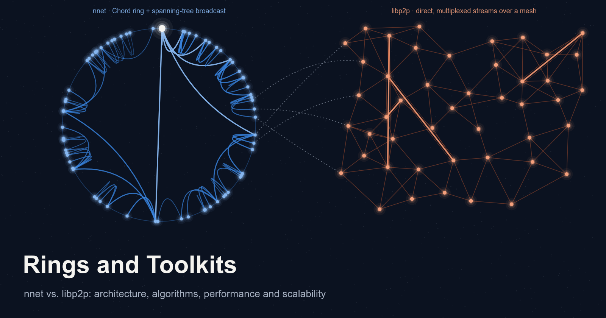

*How NKN's Chord-based overlay and Protocol Labs' modular networking stack take very different approaches to peer-to-peer networking: architecture, algorithms, performance and scalability.*

---

## TL;DR

**nnet** ([github.com/nknorg/nnet](https://github.com/nknorg/nnet)) and **libp2p** ([libp2p.io](https://libp2p.io)) both get called "p2p network stacks", but they solve different problems.

- **nnet is an overlay network.** Every node joins one structured topology, an enhanced **Chord ring**, and from then on the network itself delivers messages. You hand nnet some bytes and a 256-bit key, and it forwards them hop by hop through the overlay to whichever node owns that key. It also has a **spanning-tree broadcast** that delivers a message to every node using about one transmission per node. The whole core is roughly 5,300 lines of Go.
- **libp2p is a connectivity toolkit.** Its job is to let any peer open an **authenticated, encrypted, multiplexed stream** to any other peer, over any transport (TCP, QUIC, WebSocket, WebTransport, WebRTC), even through NATs. Overlays such as the **Kademlia DHT** and **GossipSub** are separate modules built on top. They help you *find* peers or *spread* messages, but point-to-point traffic normally runs over a direct connection rather than being relayed through the overlay.

So nnet makes **"route this message through the network"** its core operation, while libp2p makes **"open a secure stream to that peer"** its core operation. Almost every other difference covered here comes from that one choice.

I also benchmarked both stacks side by side from 16 to 256 nodes (§7.4). **For broadcast, both scale flat**, with cost per delivery independent of network size. nnet's single-copy tree is about 5× leaner on the wire and 3.5× cheaper in CPU than GossipSub, but loses up to 1.6% of messages; with redundancy (K = 3) it costs about the same as GossipSub. **For point-to-point messages to random destinations**, libp2p's direct streams are 2–3× cheaper while every node can stay connected to every other, but their cost grows with N; nnet's relay grows only logarithmically and becomes cheaper once nodes can't keep connections to everyone.

| | **nnet** | **libp2p** |
|---|---|---|
| Core abstraction | Message routed over a Chord overlay | Secure, multiplexed stream to a peer |
| Topology | One built-in structured ring (Chord, extensible) | None mandated. DHT and pubsub meshes are optional modules |
| Identity | Arbitrary 32-byte ID (application decides) | PeerID = hash of a public key, verified in the handshake |
| Addressing | `tcp://host:port`, `kcp://host:port` | Multiaddr, e.g. `/ip4/1.2.3.4/udp/4001/quic-v1/p2p/12D3…` |
| Transports | TCP, KCP (reliable UDP) | TCP, QUIC, WebSocket, WebTransport, WebRTC(-direct), and more |
| Security | None built in; added through middleware | Noise or TLS 1.3, mandatory |
| Multiplexing | smux (default) or yamux, with a fixed pool of streams | yamux (QUIC streams native), one stream per protocol interaction |
| Unicast to a non-neighbor | Multi-hop relay, ≤ log₂N hops w.h.p. | Look up the peer (DHT), then dial directly (possibly with hole punching) |
| Broadcast | Flooding, or a Chord spanning tree (≈1×N transmissions) | GossipSub mesh (≈D×N eager, D=6) plus lazy gossip |
| NAT | UPnP / NAT-PMP via middleware | AutoNAT v2, Circuit Relay v2, DCUtR hole punching, UPnP |
| Overload handling | Bounded channels that **drop** when full | Flow-controlled streams plus a hierarchical **Resource Manager** |
| Languages | Go | Go, Rust, JS/TS, Nim, Java/Kotlin, C++, Python, Zig, .NET… |
| Main production user | NKN (tens of thousands of nodes) | IPFS, Ethereum consensus layer, Filecoin, Polkadot, Celestia, … |

---

## 1. Two philosophies

It helps to start with the question each project set out to answer.

**NKN** (New Kind of Network) wanted a data-transmission network in which *relaying other people's packets is the product*. Nodes earn rewards for forwarding traffic, so the overlay must be **deterministic and verifiable**. Given everyone's ID, anyone should be able to check that a node chose the right neighbors and forwarded to the right next hop. NKN's design document says it chose Chord over Kademlia for exactly this reason: in Chord, "the choice of neighbors and route is deterministic given all nodes address on the ring" ([NKN DDTN design doc](https://github.com/nknorg/nkn/wiki/Tech-Design-Doc%3A-Distributed-Data-Transmission-Network-%28DDTN%29)). nnet is the reusable networking layer pulled out of that system.

**libp2p** began as the networking layer of IPFS and turned into a general framework. Its main goal is to **decouple applications from network assumptions**. Peers may be browsers, phones, servers behind carrier-grade NAT, or nodes on a private network, and they may share no transport at all. libp2p focuses on reachability, identity, security and protocol negotiation, and leaves topology to the application.

One way to picture it: **nnet is a postal system** (drop a letter addressed to a key, and the network carries it), while **libp2p is a phone system** (dial a number and get a private line, and the directory is a separate service).

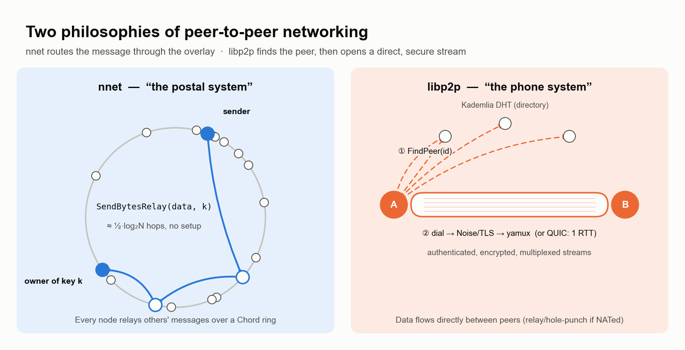
*Figure 1. The core difference: nnet carries the message across the overlay, while libp2p uses the overlay only as a directory and then opens a direct, encrypted stream.*

---

## 2. nnet architecture

### 2.1 Layered design

nnet is organized as a stack of small, swappable layers, all tied together by a middleware system:

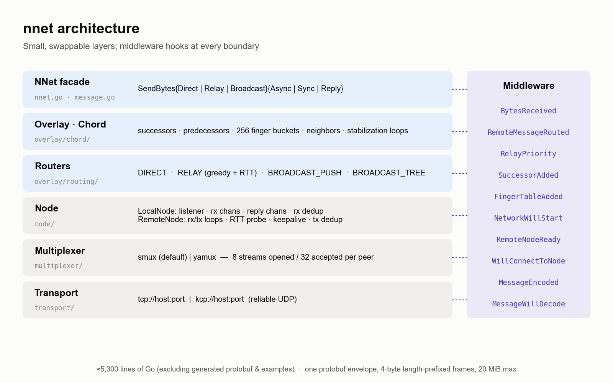
*Figure 2. nnet's layers and the middleware hooks that connect them.*

The code layout matches the diagram closely. The interesting parts sit in `overlay/chord/` (Chord topology, relay routing, tree broadcast), `node/remotenode.go` (the per-peer I/O engine) and `overlay/routing/routing.go` (the generic router pipeline).

### 2.2 Identity and addressing

A node's ID is a 32-byte value (`NodeIDBytes: 32`, so a **256-bit ring**). nnet creates a random one unless you supply your own. **nnet does not tie IDs to keys.** During the handshake (`ExchangeNode`), each side simply states its `{id, addr, data}`. Binding IDs to public keys, which a permissionless network needs to resist Sybil attacks, is left to the embedding application. NKN does this in its own codebase.

Addresses are URI-like, with the transport as the scheme: `tcp://203.0.113.5:30001` or `kcp://…`. Each node chooses its own listening transport, and a node that supports several transports can talk to peers on any of them. That is the "transport-aware address scheme" the README advertises. If `Hostname` is left empty, the remote side fills it in from the observed connection address, which gives a crude version of libp2p's "observed address" feature.

### 2.3 The wire protocol

Every message is a protobuf envelope:

```protobuf
message Message {
  RoutingType routing_type = 1;   // DIRECT, RELAY, BROADCAST_PUSH, BROADCAST_TREE
  MessageType message_type = 2;   // PING, EXCHANGE_NODE, STOP, GET_SUCC_AND_PRED, FIND_SUCC_AND_PRED, BYTES
  bytes message     = 3;          // inner payload
  bytes message_id  = 4;          // 8 random bytes by default
  bytes reply_to_id = 5;          // set on replies → sync request/response
  bytes src_id      = 6;
  bytes dest_id     = 7;          // ring key for RELAY
}
```

On the wire, a frame is a **4-byte big-endian length prefix followed by the marshalled protobuf**, with a maximum message size of 20 MiB. This envelope carries both overlay control traffic (find successors, ping) and application payloads. There is only one "protocol", and routing behavior is selected by `routing_type`. libp2p takes the opposite approach and gives every interaction its own protocol ID and stream.

### 2.4 The per-peer I/O engine

`RemoteNode` (in `node/remotenode.go`) is where nnet's throughput comes from. For each peer connection:

1. A **multiplexer session** (smux by default) is created on the raw connection. The dialer opens `NumStreamsToOpen = 8` streams and the listener accepts up to `NumStreamsToAccept = 32`.
2. Each stream runs an **`rx` goroutine** that reads length-prefixed frames, passes the bytes through `MessageWillDecode` middleware (where decryption would go), unmarshals them and pushes the result into `rxMsgChan`.
3. Each active stream also runs a **`tx` goroutine**. All of them pull from one shared `txMsgChan`. **Messages to a peer are therefore spread across 8 parallel streams**, which avoids head-of-line blocking from a single large message and allows marshalling to happen in parallel.
4. A single **`handleMsg` goroutine** dedups and dispatches incoming messages to a per-routing-type channel on the `LocalNode`, and runs a keepalive timer (20 s by default).
5. A **`startMeasuringRoundTripTime` goroutine** pings the peer about every 5 s (with ±20% jitter) and keeps a smoothed RTT, `rtt = (rtt + sample) / 2`. As §3.3 shows, routing uses this value.

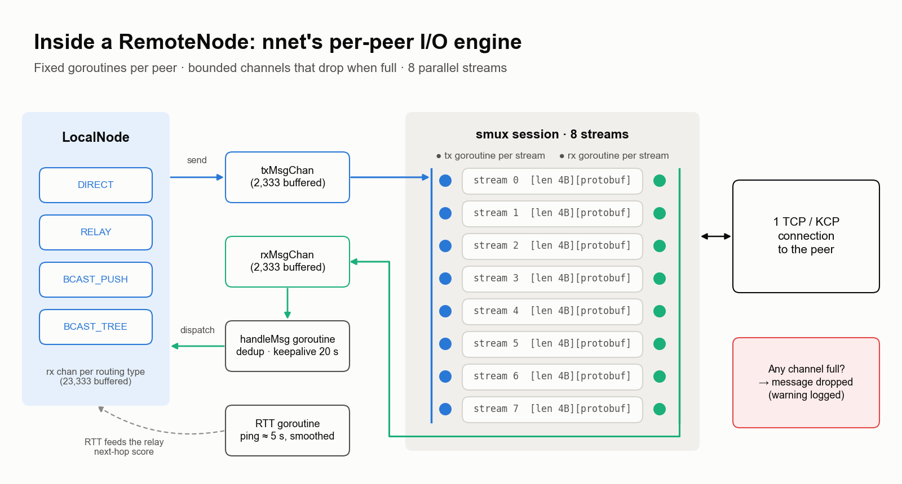
*Figure 3. One RemoteNode: a shared tx channel fans out to 8 stream writers, 8 stream readers fan in to one rx channel, and any full channel drops the message.*

The README promises "a fixed number of goroutines and connections … given network size." More precisely, the number of goroutines per peer is constant (about 3 + 2 × streams), the number of peers is O(log N), and **neither grows with message volume**. Router workers are set by constants (`numWorkers = 1` per router).

**Backpressure is lossy.** Every channel handoff is a non-blocking `select { case ch <- msg: default: log.Warning("… full, discarding msg") }`. Buffers are large (2,333 per peer, 23,333 per routing type), but once they fill up nnet **drops messages** rather than slowing senders. That is reasonable for a network where higher layers (NKN's session protocol, blockchain gossip) retransmit or tolerate loss. It is also a sharp contrast with libp2p's flow-controlled streams.

### 2.5 Sync messaging without threads

nnet has a convenient request/response model. `SendBytesRelaySync(data, key)` sends a message and blocks until a reply arrives or the request times out. It works like this:

- When sending, `AllocReplyChan(msgID, timeout)` stores a channel in an expiring cache, keyed by message ID.
- The responder calls `SendBytesRelayReply(msgID, data, srcID)`, which sets `reply_to_id = msgID` and routes the reply back to the sender's ID over the overlay.
- When the reply reaches the original node, `sendMessageToLocalNode` sees that `reply_to_id` is set, looks up the waiting channel and delivers the reply directly. No handler sees it.

Because replies are routed by key, **a request/response exchange works between any two nodes on the ring, even when they have no direct connection.** libp2p has no equivalent of this. You would build it yourself on top of streams.

### 2.6 Middleware as the extension mechanism

Almost every lifecycle event in nnet is a **typed, prioritized middleware chain**: `RemoteNodeConnected`, `RemoteNodeReady`, `WillConnectToNode`, `MessageEncoded`, `MessageWillDecode`, `BytesReceived`, `RemoteMessageRouted`, `RelayPriority`, `SuccessorAdded`, `FingerTableAdded`, `NetworkWillStart`, and many more. A middleware is just a function that returns `(possiblyModifiedArgs…, callNext bool)`. Chains run from highest priority to lowest, and nnet's own internals register at priority 0.

This is how nnet adds features that libp2p builds in:

- **Encryption.** The encryption example installs AES-GCM in `MessageEncoded` / `MessageWillDecode` with a fixed key, and its comments note that production code should derive per-node or per-session keys.
- **NAT traversal.** UPnP/NAT-PMP port mapping runs in `NetworkWillStart`.
- **Access control.** Return `false` from `WillConnectToNode` or `RemoteNodeConnected`.
- **Routing policy.** `RelayPriority` lets you replace the RTT-based next-hop score (§3.3).

This design is very flexible and keeps the core small. The trade-off is that **security is opt-in and easy to get wrong**, whereas libp2p makes it mandatory.

---

## 3. nnet's core algorithms

### 3.1 An "improved Chord": neighbor *lists* instead of neighbor *pointers*

Classic Chord (Stoica et al., 2001) gives each node one successor pointer, one predecessor pointer, and m finger pointers, where `finger[i]` is the first node at or after `id + 2^i`. nnet generalizes **every pointer into a bounded, sorted list**, the `NeighborList`:

```go
successors   = NeighborList(start=id+1, end=id-1, cap=MinNumSuccessors /*8*/,  reversed=false)
predecessors = NeighborList(start=id-1, end=id+1, cap=MinNumSuccessors,         reversed=true)
fingerTable[i] = NeighborList(start=id+2^i, end=id+2^(i+1)-1, cap=NumFingerSuccessors /*3*/)   // i = 0..255
neighbors    = NeighborList(all, unbounded)    // every connected peer
```

A `NeighborList` keeps the closest `cap` nodes (by clockwise distance from `start`) that fall within its ID range. `AddOrReplace` inserts a node only if it is closer than the current farthest entry, and evicts that entry when the list is full. Several things follow from this:

- **Redundant fingers.** Each finger bucket holds up to 3 nodes rather than 1. That gives routing alternatives when a node fails and lets the router choose the lowest-latency candidate (§3.3).
- **Adaptive successor list size.** `updateSuccPredMaxNumNodes` sets the successor/predecessor capacity to `max(8, NumSuccessorsFactor × nonEmptyFingers)`. The number of non-empty fingers is about log₂N, so the lists grow to about **2·log₂N**. This is exactly the O(log N) successor list Chord's theory requires to survive churn, and here it scales automatically as the network grows.
- **Connection lifecycle tied to topology.** When a node is evicted from every list, `MaybeStopRemoteNode` closes its outbound connection. Connections exist only while the topology needs them, and nothing like a separate connection manager is required.

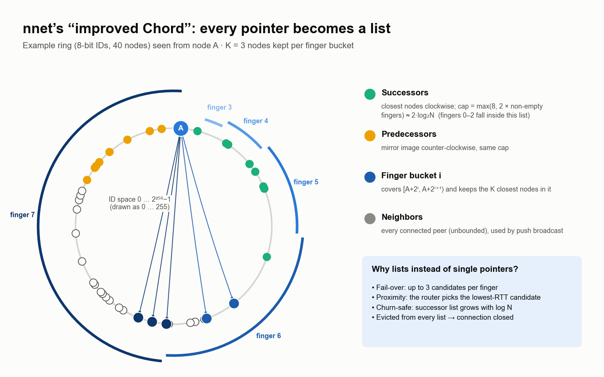
*Figure 4. Node A's neighbor lists on a small example ring. Each finger bucket keeps up to K = 3 nodes instead of a single pointer.*

**Estimated per-node state:** about log₂N non-empty fingers × 3, plus 2 × 2·log₂N successors and predecessors, minus overlap (low fingers usually coincide with successors). That works out to roughly **5–7·log₂N connections**, around 70–90 at 10,000 nodes. This is my estimate from the code, not a measured figure.

### 3.2 Join and stabilization

**Join.** A new node connects to any seed (`Join("tcp://seed:port")`). Once that first neighbor is ready, it calls `FindSuccessors(id - 1, cap)`. That is a relay-routed `FIND_SUCC_AND_PRED` request, which travels around the ring to the node responsible for the key and returns its successor and predecessor lists. The new node connects to those successors and starts stabilizing.

**Stabilization** runs as six independent loops, each with randomized jitter (`BaseStabilizeInterval = 2s`, ±⅓):

| Loop | Period | What it does |
|---|---|---|
| `updateSuccessors` | ~1× base | Ask a successor (the first one or a random one, 50/50) for its successors/predecessors, and connect to any closer nodes |
| `updatePredecessors` | ~3× base | Same, mirrored |
| `findNewPredecessors` | ~5× base | `FindPredecessors(id-1)` through the ring. **Skipped if the node has no inbound connections**, since that suggests it is behind NAT and should not ask others to treat it as a successor |
| `updateFinger` | ~1× base per non-empty finger | Refresh each finger bucket from its members' neighbor lists |
| `findNewFinger` | ~1× base per finger index | `FindSuccessors(id + 2^i)` and connect if the result is closer. The loop skips ahead across empty finger ranges |
| `stopInboundFingers` | ~10× base | Close one *inbound* finger connection per bucket, unless that node is a predecessor |

The last loop shows a subtle design principle. **nnet routes only over connections it dialed itself (or over predecessors).** In relay routing:

```go
if !rn.IsOutbound && !rr.chord.predecessors.Exists(rn.Id) {
    continue // never use an inbound, non-predecessor connection as a next hop
}
```

Inbound connections come from other nodes' choices, and a malicious node could open many of them. Outbound connections come from your own deterministic, verifiable Chord computation. Restricting next hops to outbound links makes it harder for an attacker to insert themselves into your routes. It also means a NATed node, which only has outbound links, still routes correctly.

### 3.3 Relay routing with proximity awareness

Here is `RelayRouting.GetNodeToRoute` with the boilerplate removed:

```go
// 1. Am I responsible? (dest ∈ [me, successor))  → deliver locally
if succ == nil || BetweenLeftIncl(me, succ.Id, dest) { return local }

// 2. Greedy: scan finger buckets from farthest to nearest
for i := 255; i >= 0; i-- {
    best, bestPrio := nil, -inf
    for _, rn := range fingerTable[i] {                // up to 3 candidates
        if !outbound(rn) && !isPredecessor(rn) { continue }
        if BetweenIncl(me, dest, rn.Id) {              // doesn't overshoot
            prio := -rtt(rn).Milliseconds()            // proximity: lower RTT wins
            prio  = RelayPriority middleware(rn, prio) // pluggable policy
            if prio >= bestPrio { best, bestPrio = rn, prio }
        }
    }
    if best != nil { return best }
}

// 3. Fallback: walk the successor list
```

This is Chord's *closest preceding finger* rule with one important addition. Within the farthest useful bucket, the router chooses the **lowest-RTT candidate** among up to `NumFingerSuccessors` nodes. This technique is known in the literature as **proximity route selection (PRS)**. Because every candidate in bucket *i* lies within [id+2ⁱ, id+2ⁱ⁺¹), any of them at least halves the remaining distance, so the O(log N) hop bound still holds. Meanwhile each hop tends to be fast. PRS has been studied extensively for Chord and Pastry and typically cuts end-to-end stretch noticeably. The `RelayPriority` middleware lets an application replace RTT with another score, such as reputation, stake or bandwidth.

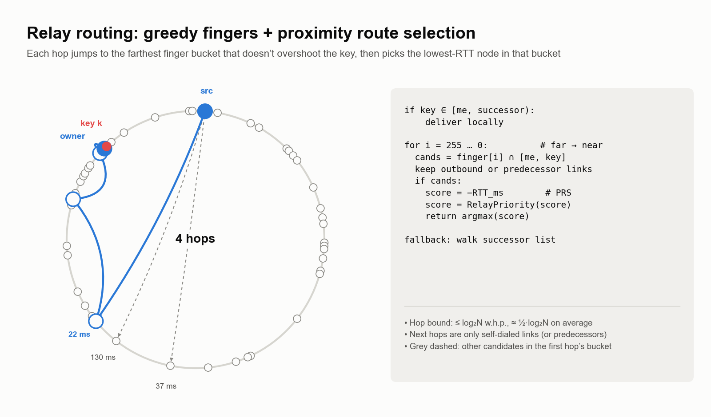
*Figure 5. A relay route on a 48-node ring. At the first hop, the 22 ms candidate wins over 37 ms and 130 ms candidates in the same finger bucket.*

**Hop count:** at most log₂N with high probability, and about ½·log₂N on average. To check this I re-implemented nnet's finger table and relay rule in a small simulator ([figure-src/sim.py](figure-src/sim.py)). Over 2,000 random lookups per network size, the mean was **6.1 hops at 10,000 nodes** (maximum 11), slightly below ½·log₂N because each bucket holds up to 3 candidates. At very small N the maximum can exceed log₂N, since that bound only holds with high probability.

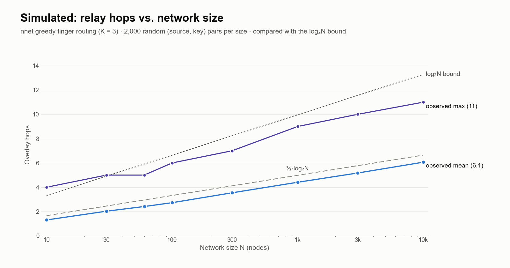
*Figure 6. Simulated relay hops grow logarithmically. The mean tracks just under ½·log₂N.*

### 3.4 Broadcast I: push (flooding)

`BroadcastRouting` forwards to **every neighbor except the sender and the origin**. Two caches stop it from looping:

- the **rx cache** (`LocalRxMsgCacheRoutingType = [BROADCAST_PUSH]`, 300 s TTL), which drops message IDs the node has already seen before routing them, and
- the **tx cache** per peer, which never sends the same message ID to the same peer twice.

Push broadcast is fast (it explores every path in parallel) and very robust, but its cost is about **N × degree** transmissions, and degree is in the tens.

### 3.5 Broadcast II: the Chord spanning tree

This is nnet's best-known feature. The finger table already defines an implicit **spanning tree rooted at any node**, an idea from El-Ansary, Alima, Brand and Haridi, *"Efficient Broadcast in Structured P2P Networks"* (IPTPS 2003). nnet implements it in about 20 lines:

```go
// BroadcastTreeRouting.GetNodeToRoute
maxIdx := 256                                   // originator: use all fingers
if msg came from remote node S {
    d      := Distance(S.Id, me.Id)              // clockwise distance S → me
    maxIdx := d.BitLen() - 1                     // I own the sub-range below that power of two
}
for i := 0; i < maxIdx; i++ {
    send to every node in fingerTable[i] (except sender / origin)
}
```

The intuition: if S reached me through its finger *j*, I am at distance roughly 2ʲ from S, and S has already assigned the higher ranges to its other fingers. So I only cover fingers 0…j−1, which is the arc between me and my next sibling in S's tree. Each node hands responsibility for disjoint sub-arcs to its own fingers, so **every node receives the message about once**. The tree's depth is ≤ log₂N.

With `NumFingerSuccessors = K`, each bucket sends to K nodes, and you get "**K-times**" delivery: redundancy K in return for K× bandwidth. At K = 1 it is a pure tree with about N−1 transmissions.

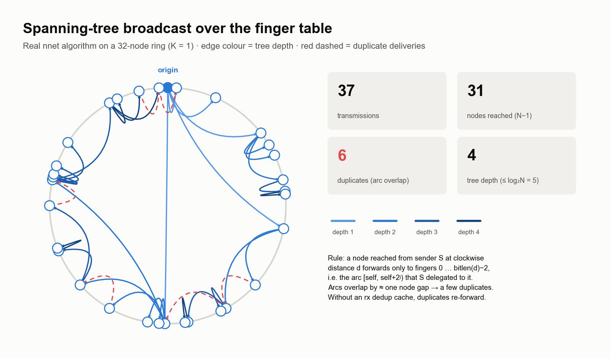
*Figure 7. The tree-broadcast rule run on a 32-node ring. Red dashed edges are the duplicate deliveries caused by overlapping arcs.*

#### What I measured

I ran the repository's own `examples/efficient-broadcast` on an Apple M4 Pro, with all nodes local over TCP. The numbers are **forwarding decisions** (next-hops chosen, as counted by the example's `RemoteMessageRouted` middleware), summed across the network for one broadcast:

| Nodes | K | Push sends | Tree sends (default config) | Tree sends per node |
|---|---|---|---|---|
| 10 | 1 | 81 | 10 | 1.0 |
| 30 | 1 | 685 | 38 | 1.27 |
| 60 | 1 | 1,767 | 92 | 1.53 |
| 100 | 1 | 3,344 | 156 | 1.56 |
| 60 | 3 | 2,219 | **3,374** | 56 |

At K = 1, tree broadcast costs **20–25× less** than push, as advertised. **At K = 3 with the default configuration, however, tree broadcast costs more than flooding.** The reason is in the defaults: the receive-side dedup cache is enabled only for `BROADCAST_PUSH`. Two effects compound:

1. **Arcs overlap slightly.** A receiver's arc is bounded by a power of two *measured from itself* (`self + 2ʲ`), while the next sibling's arc starts at `S + 2ʲ⁺¹`. Since `self ≥ S + 2ʲ`, the two arcs overlap by the gap between `S + 2ʲ` and `self`, roughly one node spacing. A node in that overlap gets the message twice, which is why K = 1 shows about 1.3–1.6 sends per node instead of exactly 1. The example's own message string says the message should be received "almost once".
2. **Duplicates aren't suppressed, so they re-propagate.** Without an rx cache for tree messages, every duplicate is forwarded down its own sub-tree. At K = 3, every bucket emits 3 copies, so this cascades.

After adding one line, `LocalRxMsgCacheRoutingType: {BROADCAST_PUSH, BROADCAST_TREE}`, the picture changes:

| Nodes | K | Push sends | Tree sends (tree dedup on) | Tree sends per node |
|---|---|---|---|---|
| 60 | 1 | 1,751 | 75 | 1.25 |
| 60 | 3 | 2,197 | 269 | 4.5 |
| 100 | 3 | 4,362 | 569 | 5.7 |

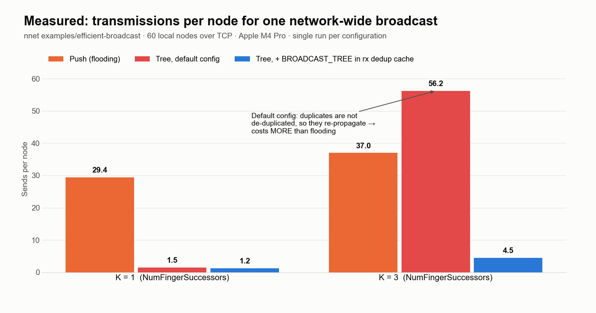
*Figure 8. Measured at 60 nodes. With K = 3 and the default configuration, the tree costs more than flooding; enabling dedup fixes it.*

#### What happens at larger scale

Local runs stop at around 100 nodes, so I ran the simulator on 64-bit rings of up to 10,000 nodes. It reproduces the local measurements closely: at 60 nodes and K = 1 it gives 1.46 sends per node without dedup and 1.24 with it, against 1.53 and 1.25 measured. At larger sizes the two configurations behave very differently:

- **With tree dedup on**, cost per node stays flat as N grows: about **1.3 (K=1), 2.9 (K=2) and 4.5 (K=3)** at 10,000 nodes.
- **With library defaults**, K = 1 stays manageable (about 1.6 per node), but K ≥ 2 **blows up as the network grows**: about 255 sends per node at K = 2 and **about 7,100 per node at K = 3** for a 10,000-node network. In practice the bounded channels would fill and start dropping messages long before that.

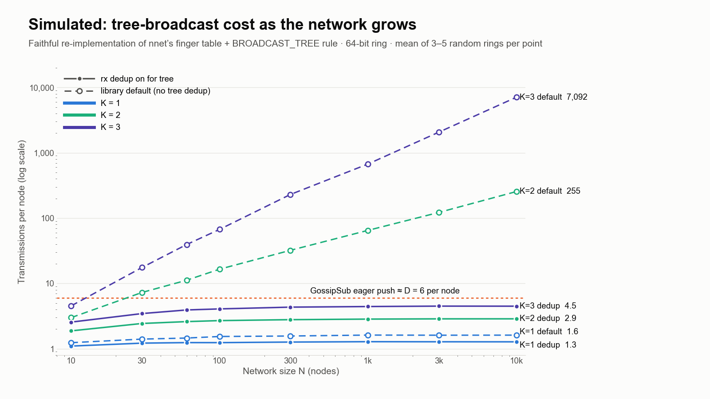
*Figure 9. Simulated tree-broadcast cost (log scale). With dedup on, cost stays flat below GossipSub's ≈6 eager sends per node. With library defaults and K ≥ 2, it grows with network size.*

**Practical advice:** if you use `BROADCAST_TREE`, add it to `LocalRxMsgCacheRoutingType`, and you can also add it to `RemoteTxMsgCacheRoutingType`. With K > 1 this is mandatory. (In NKN's production configuration this is presumably tuned. These results apply to the library's defaults.)

#### Throughput impact

nnet's `message-benchmark` floods broadcast messages and reports unique messages received per node. On the M4 Pro with 16 local nodes:

| Mode | Unique msgs/s per node (1 KB) |
|---|---|
| Push | ~5,000 |
| Tree (K=1) | ~13,500 |

That is about 2.7× better with every process sharing one machine's CPU. The README reports about 10× on a 2018 MacBook Pro (300 vs. 3,000 messages/s). Both results point the same way: when nodes are bandwidth- or CPU-bound, removing redundant copies translates directly into application throughput.

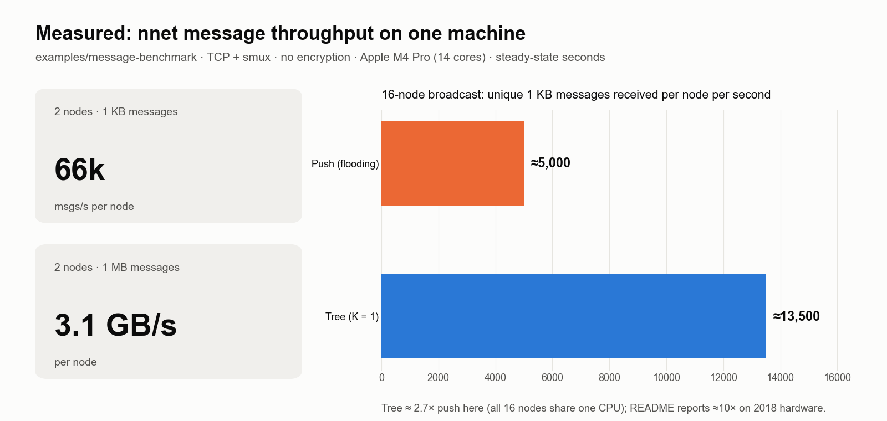
*Figure 10. nnet throughput measured on one machine. These are relative numbers: every node shares the same CPU and loopback interface.*

**The trade-off is robustness.** A tree has single points of failure. If an interior node crashes mid-broadcast, its whole sub-arc misses the message. Flooding (and GossipSub) route around failures automatically. nnet's README describes this choice explicitly: use push for small, critical messages (votes), use tree for high-volume, loss-tolerant ones (transactions), and use pull, which was planned but never implemented, for large critical ones (blocks).

---

## 4. libp2p architecture

### 4.1 The building blocks

libp2p is a set of specifications ([github.com/libp2p/specs](https://github.com/libp2p/specs)) with interoperable implementations in many languages. The reference implementation, go-libp2p (v0.50 at the time of writing), is organized as follows:

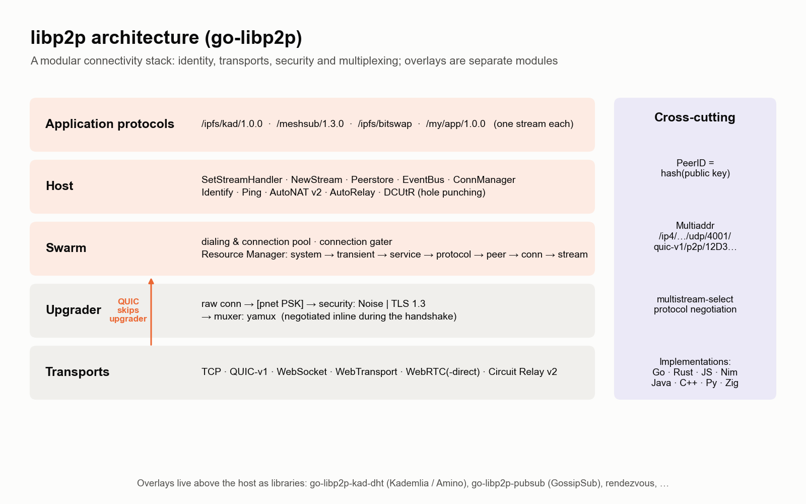
*Figure 11. go-libp2p's layers. QUIC skips the upgrader because TLS 1.3 and streams are built into the transport.*

By default go-libp2p listens on TCP, QUIC-v1, WebTransport and WebRTC-direct over both IPv4 and IPv6, and enables TLS and Noise for security with yamux for multiplexing (`defaults.go`).

### 4.2 Identity: PeerID

Every libp2p node has a key pair, and its **PeerID is a multihash of its public key**. Ed25519 keys are embedded directly using the identity hash. The security handshake (Noise XX or TLS 1.3 with a libp2p certificate extension) **proves possession of the key**, so after any connection you know cryptographically who is on the other end. nnet leaves this entirely to the application.

### 4.3 Multiaddr: self-describing, composable addresses

`/ip4/198.51.100.7/udp/4001/quic-v1/p2p/12D3KooW…` encodes the whole protocol stack needed to reach a peer. Addresses compose. For example, a relayed address looks like `…/p2p/<relay>/p2p-circuit/p2p/<target>`. nnet's `tcp://h:p` covers one level of the same idea.

### 4.4 The connection upgrade pipeline

On stream-oriented transports such as TCP and WebSocket, a raw connection goes through:

1. **multistream-select** negotiates the security protocol (`/noise` or `/tls/1.0.0`).
2. The **security handshake** authenticates the PeerID and sets up encryption.
3. The **stream muxer** is negotiated. libp2p optimizes this with **inlined muxer negotiation**: the muxer choice is carried inside the Noise handshake extensions or TLS ALPN, which saves a round trip.
4. Every new stream runs multistream-select again to agree on an **application protocol ID**.

QUIC skips steps 1–3 entirely because TLS 1.3 and native streams are built into the transport. That is why QUIC is the preferred transport in modern libp2p: connection setup takes 1 RTT instead of several.

The **one-stream-per-interaction** model is the core contrast with nnet. In libp2p, a DHT query, a GossipSub session and a bitswap exchange each run on their own stream, each with its own protocol ID and flow-control window. In nnet, everything shares one envelope over a fixed pool of streams.

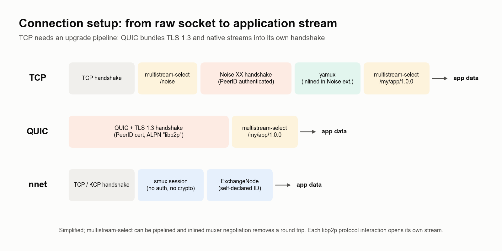
*Figure 12. Steps from raw socket to first application byte (simplified). nnet's setup is the shortest because it skips authentication and encryption.*

### 4.5 NAT traversal as a first-class stack

libp2p includes the most complete decentralized NAT traversal stack in common use:

- **Identify** tells you which address peers observe for you.
- **AutoNAT v2** has peers dial you back to determine whether you are publicly reachable, and tests individual addresses.
- **Circuit Relay v2** lets a private node reserve a slot on a public relay, which then forwards traffic, subject to time and data limits. Reservations make relaying cheap and resistant to abuse, so any public node can offer it.
- **DCUtR (Direct Connection Upgrade through Relay)** uses the relayed connection to coordinate a simultaneous-open hole punch. It measures RTT over the relay so both sides can fire their SYNs or QUIC packets at the same moment.

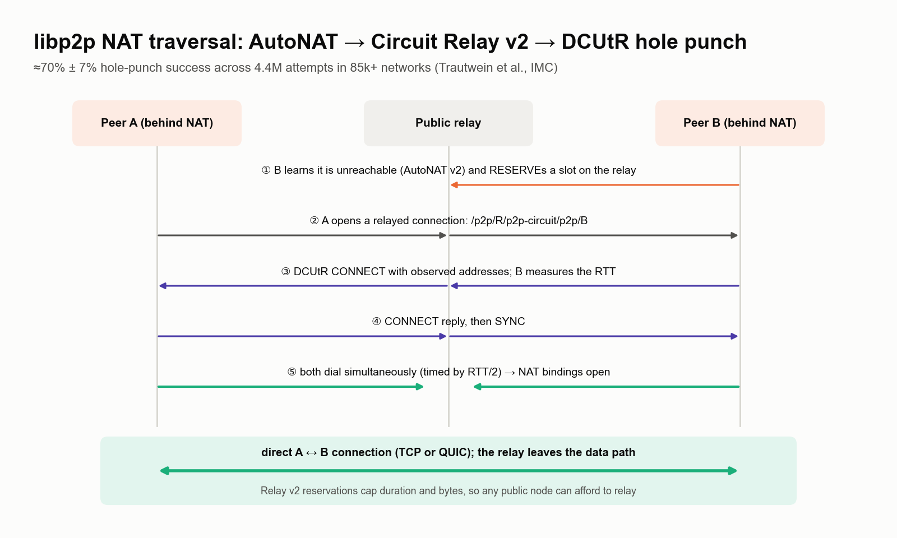
*Figure 13. How two NATed libp2p peers end up with a direct connection.*

A large measurement study across 4.4 million traversal attempts in 85,000+ networks found DCUtR hole punching succeeds about **70% ± 7%** of the time, with no significant difference between TCP and QUIC, and 97.6% of successes on the first attempt ([Trautwein et al., *Challenging Tribal Knowledge*, arXiv 2510.27500](https://arxiv.org/abs/2510.27500); [ProbeLab](https://probelab.io/blog/can-libp2p-punch-through-nats/)).

nnet, by comparison, supports UPnP/NAT-PMP port mapping (in an example middleware) and a graceful-degradation rule: a node with no inbound connections does not advertise itself as anyone's successor. NKN handles unreachable devices with a client/node split, in which clients connect outbound to nodes and nodes must be reachable. That is a valid architectural choice, but it means only publicly reachable nodes can take part in the ring.

### 4.6 Resource management

go-libp2p's **Resource Manager** enforces hierarchical limits on memory, file descriptors, connections and streams across nested *scopes*: system → transient → service → protocol → peer → connection → stream. The **Connection Manager** trims connections between low and high watermarks, protecting tagged peers. The **connection gater** gives policy hooks at each dial and accept stage. Together they give libp2p a defense against resource-exhaustion DoS that nnet lacks. In nnet, buffers are bounded, but nothing limits how many inbound connections a peer may open, and overload is handled by dropping messages.

---

## 5. libp2p's core algorithms

### 5.1 Kademlia DHT

libp2p's DHT ([spec](https://github.com/libp2p/specs/tree/master/kad-dht); the public instance is called **Amino**) uses **XOR distance** over SHA-256 keys:

- **k-buckets** with `k = 20` (`amino.DefaultBucketSize`),
- **iterative lookups** with concurrency `α = 10` (`DefaultConcurrency`), ending once the `β = 3` closest peers (`DefaultResiliency`) have responded,
- routing-table refresh every 10 minutes,
- **provider records** ("peer X has content Y") republished every 22 h and expiring after 48 h on IPFS.

Kademlia's lookups are *iterative*: the querier contacts each hop itself. nnet's Chord lookups are *recursive*: the message is forwarded hop by hop. With iterative lookups the querier controls parallelism and timeouts, and a single slow or malicious hop is easy to route around, because α requests are in flight at once. Recursive routing needs fewer round trips back to the origin and lets each hop apply local knowledge, such as nnet's RTT-based choice, but the origin has to trust every intermediate node to forward faithfully.

XOR distance is **symmetric**, so a node learns useful routing entries from incoming queries. Chord's clockwise distance is **asymmetric**, so it cannot. On the other hand, Chord's neighbor sets are **deterministic**: for any ID, exactly one correct finger set exists. That is what makes NKN's neighbor choice verifiable. Kademlia allows any of k nodes per bucket and leaves the choice to the node, which is good for liveness and bad for auditability.

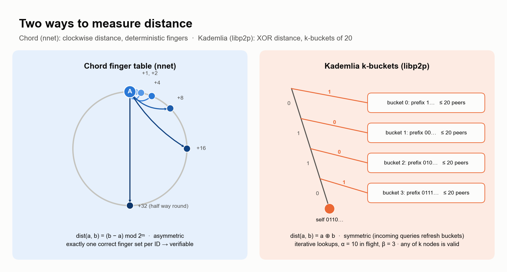
*Figure 14. Chord's power-of-two fingers give each ID one correct neighbor set. Kademlia's XOR prefix buckets accept any of k peers.*

The biggest difference is in **what the DHT is used for**. In libp2p the DHT is a *directory*: `FindPeer(id)` returns addresses, and then you dial directly. In nnet the overlay is the *data path*: the message itself travels across the hops.

### 5.2 GossipSub

GossipSub ([spec](https://github.com/libp2p/specs/tree/master/pubsub/gossipsub)) is libp2p's pubsub protocol and the message layer of the Ethereum consensus network. Each topic maintains a **sparse random mesh**:

| Parameter (go defaults) | Value | Meaning |
|---|---|---|
| `D` | 6 | target mesh degree (full messages pushed eagerly) |
| `Dlo` / `Dhi` | 5 / 12 | GRAFT below / PRUNE above |
| `Dlazy` | 6 | peers that receive IHAVE metadata gossip |
| Heartbeat | 1 s | mesh maintenance + gossip emission |
| `mcache` | 5 windows, gossip from 3 | history for IWANT responses |

Full messages travel over the mesh (*eager push*, about D copies per node). Message IDs are gossiped lazily to other peers (*IHAVE*), and peers that missed a message ask for it (*IWANT*). Protocol versions have added:

- **v1.1:** peer scoring (P1–P7: time in mesh, first deliveries, mesh delivery deficit, invalid messages, IP colocation, behavior penalties), flood publishing, peer exchange on PRUNE, opportunistic grafting, backoff. Together these make the mesh resistant to Sybil and eclipse attacks.
- **v1.2:** **IDONTWANT**. On receiving a large message (≥ 1 KiB by default), a node tells its mesh peers not to send it, which cuts duplicate bandwidth for big payloads.
- **v1.3:** an extensions control message, providing a negotiation framework for features such as the **Partial Messages** draft (2025), where peers transmit only the parts of a large message (for example blob/erasure-coded chunks) that their peer is missing.

### 5.3 GossipSub vs. nnet's broadcasts

These are three points on the same robustness/efficiency curve:

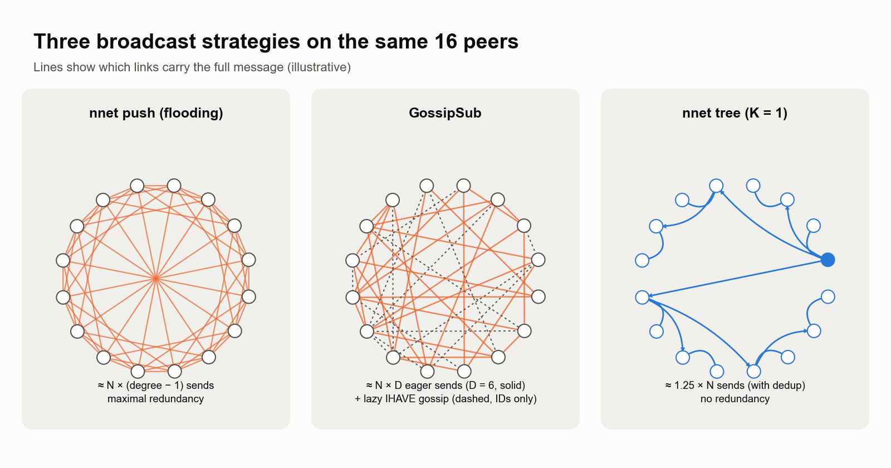
*Figure 15. Flooding, GossipSub and the Chord tree on the same 16 peers. Redundancy, and therefore bandwidth, falls from left to right.*

| | nnet push | GossipSub | nnet tree (K) |
|---|---|---|---|
| Transmissions for N nodes | ≈ N·(deg−1), deg ~ tens | ≈ N·D (D=6) + IHAVE metadata | ≈ K·N (with dedup on) |
| Path redundancy | Maximal | D paths + lazy repair | K paths |
| Depth / latency | Shortest path in a degree-~log N graph | ≈ log_D N mesh hops | ≤ log₂N hops (avg ≈ ½log₂N) |
| Recovery from interior failure | Automatic | Automatic (IWANT, mesh repair) | None, the sub-tree is lost (unless K>1) |
| Topic / subscription support | No (whole network) | Yes, per-topic meshes | No (whole network) |
| Byzantine resistance | Implicit (redundancy) | Explicit (peer scoring) | Low |

At K = 1 (≈1.25 sends per node with dedup on), nnet's tree is **about 5× more bandwidth-efficient than GossipSub's eager push** (≈6 per node) for network-wide broadcast, and far more efficient than flooding. At K = 3 the two cost roughly the same (≈5 vs. ≈6 per node), and GossipSub's self-healing mesh is clearly the better deal. GossipSub gives up some of that bandwidth for **self-healing, per-topic membership and defenses against attackers**, which matter in open, adversarial networks like Ethereum. GossipSub's recent additions (IDONTWANT, partial messages) go after the same redundant-copy waste that nnet's tree eliminates, but they do it without giving up robustness.

---

## 6. Performance

### 6.1 Raw messaging throughput

nnet's local benchmark (`examples/message-benchmark`, 2 nodes on one machine over TCP + smux) on an Apple M4 Pro:

| Message size | Throughput per node |
|---|---|
| 1 KB | ~66,000 msgs/s (~65 MB/s) |
| 1 MB | ~3,000–3,200 msgs/s (~3.1 GB/s) |

The README reports about 75k msgs/s and about 900 MB/s on a 2018 MacBook Pro. My 1 KB result is in the same range even on a much faster CPU, which suggests that **small-message throughput is limited by nnet's single-goroutine routing pipeline** (`numWorkers = 1` per router, a single `handleMsg` per peer, protobuf marshalling) rather than by raw CPU. Large-message throughput, which is dominated by memory copies and syscalls, scales with the hardware.

**libp2p** measures performance with its standardized `/perf/1.0.0` protocol ([spec](https://github.com/libp2p/specs/blob/master/perf/perf.md)) and publishes continuously updated results comparing each implementation and transport against iperf, raw HTTPS and raw quic-go baselines on the [libp2p performance dashboard](https://docs.libp2p.io/status). Because the dashboard reports each implementation next to the raw iperf/quic-go numbers on the same host, it shows libp2p's overhead directly. That overhead comes mainly from mandatory encryption (which nnet skips by default) and from muxer framing. Check the dashboard for current figures, since they change with each release.

These numbers **are not directly comparable**, and that should be stated plainly:

- nnet's benchmark counts **application messages** through the full routing stack, with **no encryption**.
- libp2p's perf benchmark measures **bulk bytes over one encrypted stream**.

For an honest comparison, nnet with AES-GCM middleware should be measured against a libp2p host sending length-prefixed messages over a stream. My expectation is that libp2p wins on bulk point-to-point transfer (QUIC, kernel offloads, flow control) and that nnet wins on **per-message overhead for small routed messages**, because it has no per-message stream setup and no protocol negotiation.

### 6.2 Latency

| Operation | nnet | libp2p |
|---|---|---|
| Message to a known, connected peer | 1 hop | 1 hop on an existing stream |
| Message to an arbitrary ID / peer, first time | ~½·log₂N overlay hops, **no setup** | DHT lookup (several RTTs, α-parallel) + dial (1 RTT QUIC, 2–3 RTT TCP+Noise+yamux) + possibly hole punch |
| Same peer, subsequent messages | still ~½·log₂N hops each | 1 hop (connection reused) |
| Network-wide broadcast | tree: ≤ log₂N hops; push: ~graph diameter | ≈ log_D N mesh hops |

nnet is well suited to **many small messages to many different keys**, such as DHT-addressed storage, NKN's address-based messaging and consensus votes. libp2p is better for **long-lived, high-volume sessions between specific peers**, where the one-time lookup and dial cost is spread across a whole stream.

### 6.3 Who pays the bandwidth?

nnet's relay model means intermediate nodes carry other nodes' traffic, roughly ½·log₂N times the payload in total across the network. In NKN this is intentional, because relaying is the economic activity that earns rewards. In a general-purpose application it is a tax: every unicast byte costs the network about 7 bytes at 10k nodes. libp2p's direct-dial model keeps the data path off third parties, except when a Circuit Relay is needed, and v2 relays deliberately cap duration and data volume.

---

## 7. Scalability

### 7.1 State and maintenance

| | nnet (Chord) | libp2p Kademlia (Amino) |
|---|---|---|
| Routing state | ~5–7·log₂N **live connections** | Up to 20 entries/bucket × ~log₂N buckets, **not all connected** |
| Maintenance | 6 loops, ~2 s base period, each issuing ring lookups | Bucket refresh every 10 min; liveness learned passively from traffic |
| Churn repair | Successor lists of size ~2·log₂N, refreshed every ~2 s | Bucket redundancy (k=20) + iterative lookups that skip dead peers |
| Lookup cost | O(log N) recursive hops | O(log N) iterative steps, α parallel |

nnet keeps **every routing entry connected**, and its stabilization loops are aggressive. That gives it fast convergence and accurate RTT measurements, which its PRS routing depends on. The costs are steady background traffic and connection pressure. Kademlia routing tables are mostly lists of known addresses, and libp2p connects to them on demand. This is part of why the Amino DHT handles hundreds of thousands of transient, often-unreachable peers, while a strict Chord ring needs its members to be stable and reachable.

### 7.2 Production evidence

- **nnet** runs NKN's mainnet, which has reportedly had **tens of thousands of nodes** at its peak. That validates the ring design at that scale with reachable, incentivized operators.
- **libp2p** runs IPFS's public DHT (hundreds of thousands of peers across many network conditions), the Ethereum consensus layer (thousands of validators' beacon nodes on GossipSub, with strict latency budgets for block and attestation propagation), Filecoin, Polkadot/Substrate and others. The variety of environments (browsers, mobile, NATed home nodes, data centers) is much larger.

### 7.3 Concurrency model and the scaling ceiling

nnet's choice of a fixed set of goroutines with large buffered channels keeps memory use predictable and avoids per-message goroutine churn. However, `numWorkers = 1` per router and one `handleMsg` per peer mean that, **on a single node, routing throughput is mostly single-core-bound per routing type**. The local benchmark shows a node saturating at about 66k msgs/s even on a 14-core machine. For a relay node in NKN this is enough. For a high-fanout service it would need tuning, and the worker counts are constants in the code, not configuration options.

libp2p handles concurrency **per stream**: each stream has its own goroutine or task in the application handler, so throughput scales with cores. The Resource Manager limits the total so that concurrency does not cause overload.

---

### 7.4 Measured: an apples-to-apples scalability benchmark

Every number above comes from a different source: nnet's examples, libp2p's dashboard, a simulator, the papers. To compare **how efficiently each stack's throughput holds up as the network grows**, I built one harness ([scalability-bench/](scalability-bench/)) that drives both stacks with the same workload and measures them the same way.

**What is held equal.** Same Go toolchain, the same process model (one process per stack and network size, each binary linking only one stack), TCP on loopback, a stream multiplexer (smux for nnet, yamux for libp2p, each stack's default), protobuf framing, 1 KB payloads from the same generator, and a **constant total load** at every N: 10,000 deliveries/s for broadcast and 5,000 messages/s for unicast. Because nnet has no encryption or message signing, the main libp2p series runs with `NoSecurity` and GossipSub `StrictNoSign`. A second series with Noise and signing shows what libp2p's secure defaults cost. GossipSub's outbound and validation queues were raised to 1,024 entries so they are comparable to nnet's buffers and don't cause artificial drops; every other GossipSub parameter is the default. The [README](scalability-bench/README.md) lists every setting.

**What is measured.** The question is not raw throughput, which on one laptop depends mostly on how many processes share the CPU. It is **cost per useful delivery**, and how that cost changes as N grows:

- **Amplification**: every application-layer byte written by every node (data, control and maintenance) divided by the payload bytes actually delivered. 1.0 is ideal.
- **CPU per delivery**: process CPU time divided by deliveries.
- **Delivery ratio and latency**, plus **connections and heap per node**.
- **Scaling elasticity**: the slope of log(cost) against log(N). 0 means cost per delivery doesn't depend on network size. 1 means it grows in proportion to N.

#### Broadcast: both designs scale, and the tree is leaner

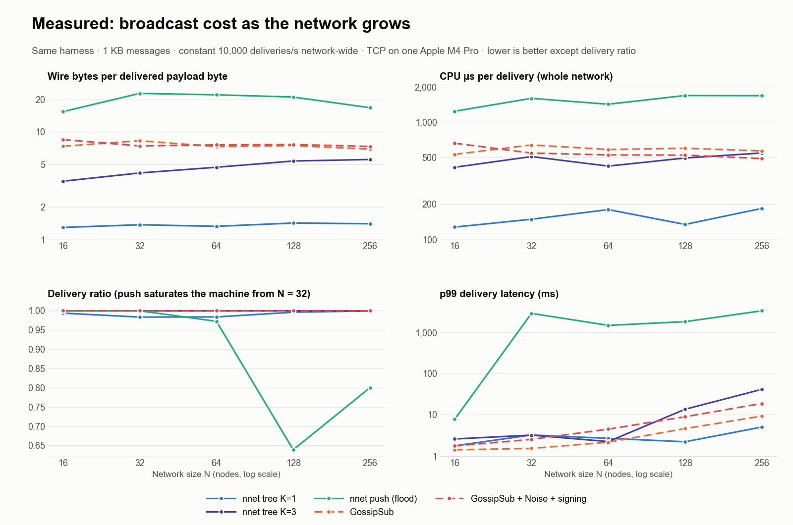
*Figure 16. Broadcast measured from 16 to 256 nodes, single run per point.*

| N = 256 | Delivered | Wire bytes / payload byte | CPU µs / delivery | p50 / p99 latency | Connections / node |
|---|---|---|---|---|---|
| nnet tree, K = 1 (dedup on) | 100.0%¹ | **1.40** | **184** | 1.5 / 5.0 ms | 42 |
| nnet tree, K = 3 (dedup on) | 100.0% | 5.55 | 546 | 4.1 / 41 ms | 57 |
| GossipSub (no security, no signing) | 100.0% | 6.93 | 568 | 1.9 / 9.3 ms | 18 |
| GossipSub + Noise + signing | 100.0% | 7.34 | 489 | 2.3 / 19 ms | 18 |
| nnet push (flooding) | 80.0% | 16.8 | 1,677 | 772 / 3,315 ms | 24 |

¹ K = 1 delivered 98.4–99.6% at 16–128 nodes. Individual nodes missed 2–11% of messages, even in this static network (see below).

Across the whole range, **cost per delivery is essentially flat for every broadcast design**: wire-byte elasticity is −0.03 for GossipSub and +0.03 for the K = 1 tree, and CPU elasticity is +0.01 and +0.09. Neither design gets more expensive per delivery as the network grows, so each node's broadcast capacity is set by its own hardware rather than by N. What differs is the constant:

- **nnet's K = 1 tree is about 5× leaner on the wire** (1.3–1.4 versus 6.9–8.3 bytes per payload byte) and **about 3.5× cheaper in CPU** (130–185 versus 530–640 µs) than GossipSub. On this machine that means one core absorbs roughly 5,400 one-KB broadcasts per second with the tree, versus roughly 1,800 with GossipSub.
- **That advantage depends on K = 1, which loses messages.** In a network with no joins or leaves, K = 1 still dropped 0.4–1.6% of deliveries at most sizes, and some individual nodes missed 2–11%. The likely cause is nnet's `stopInboundFingers` loop, which deliberately closes inbound finger connections every ~20 s and briefly leaves holes in a tree that has no redundancy.
- **K = 3 fixes delivery and gives most of the advantage back.** It delivered 100% at every size, but costs 3.5–5.6 bytes per payload byte (rising slowly, elasticity +0.17) and 410–550 µs per delivery, about the same CPU as GossipSub. Its p99 latency also grew fastest of the reliable options (41 ms at 256 nodes against 9 ms for GossipSub), because a tree with K = 3 sends three copies along every finger, so a few high-fan-out nodes do a lot of the work.
- **Flooding doesn't survive this load at all.** At 15–23 bytes and about 1.6 ms of CPU per delivery, 10,000 deliveries/s needs more than the 14 cores available. From 32 nodes up, latency rose to seconds and delivery fell to 64–80%. Its flat elasticity is therefore a floor, not a sign of scalability.
- **libp2p's security is almost free here.** Noise plus signing added at most about 15% in bytes, and its CPU per delivery was even slightly lower at larger N. That is run-to-run noise (about ±15% on single runs), but it means encryption is not where GossipSub's cost comes from; its eager-push redundancy is.

#### Unicast: relaying wins once the network outgrows all-to-all connections

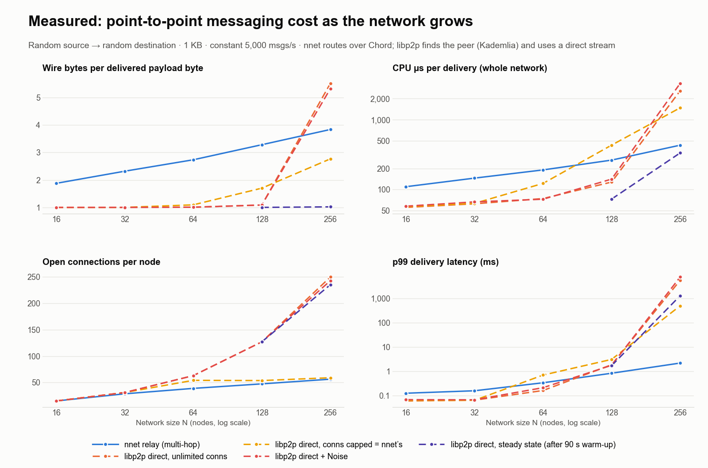
*Figure 17. Random node to random node. nnet relays over the ring; libp2p looks the peer up with Kademlia and opens a direct stream, which it keeps.*

Unicast is where the two philosophies from §1 actually collide:

- **nnet relay** costs about ½·log₂N hops per message. Wire amplification rose from 1.9 to 3.8 bytes per payload byte and CPU from 110 to 431 µs per delivery between 16 and 256 nodes (elasticities +0.26 and +0.48, i.e. roughly logarithmic). Connections per node grew only from 15 to 56, and p99 latency stayed at 2 ms or below.
- **libp2p direct streams** cost one hop, so **up to 128 nodes they are 2–3× cheaper** (1.0 bytes per payload byte, 56–128 µs). But with uniformly random destinations every node eventually connects to every other node, so connections grew to N − 1 (elasticity +1.0).
- **At 256 nodes, the cold run collapsed.** There are 65,280 sender/receiver pairs, and in a 20-second window almost every message is a pair's first contact, which needs a DHT lookup and a new connection. Only 28% of messages were delivered within the drain window, CPU cost was about 2.6 ms per delivery and p99 latency was 5.5 s.
- **Warmed up for 90 s first, libp2p direct recovered** to 99.9% delivered at 1.02 bytes per payload byte, **but CPU per delivery still rose 4.6× from 128 to 256 nodes** (73 → 334 µs), against 1.6× for nnet relay (270 → 441 µs). p99 latency was still 1.3 s, because about 20 connections per node were still being established. Some of that CPU growth is the cost of 30,000 TCP connections inside one process, but that is exactly the cost an O(N) connection pattern creates.
- **With the same connection budget as nnet** (a libp2p connection manager capped at nnet's measured count for each N), libp2p direct was cheaper at 64 nodes (122 versus 191 µs) but **more expensive from 128 nodes** (432 versus 264 µs, and 1,477 versus 431 µs at 256 nodes with only 90% delivered), because every trimmed connection must be re-dialed.

So the crossover depends on **how concentrated the traffic is**, not on the stacks themselves. libp2p's direct streams win when each node talks to a stable set of peers, which is how most libp2p applications behave (block exchange with a few dozen peers, RPC to known services). nnet's relay wins when destinations are diffuse and the network is larger than the number of connections a node can keep open, which is exactly NKN's workload: messages addressed to arbitrary keys across a large network.

#### Idle overhead: nnet pays continuously, libp2p pays on demand

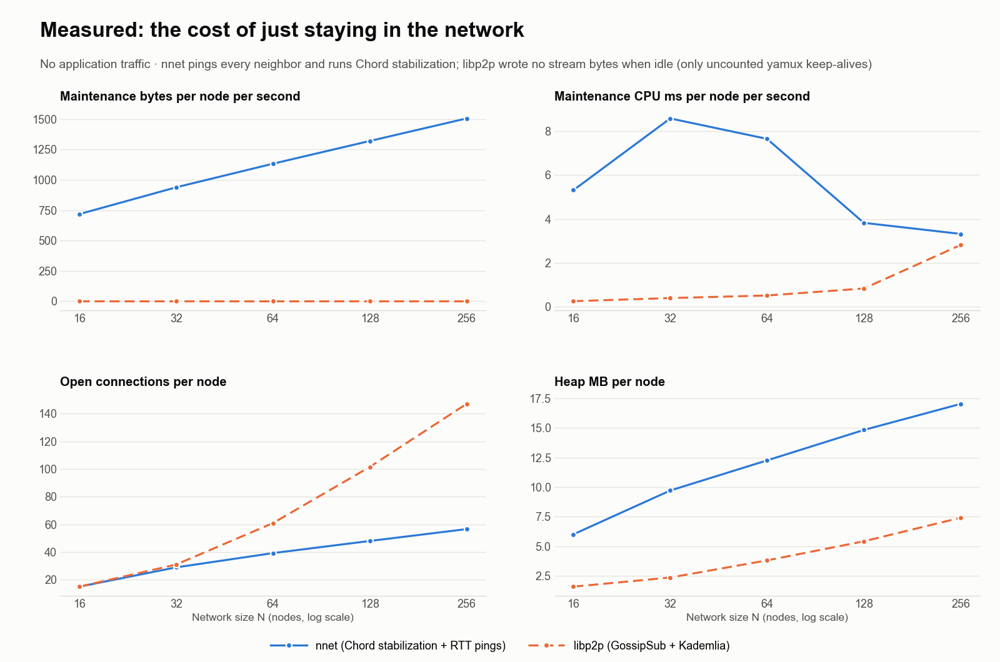
*Figure 18. No application traffic.*

With no traffic, nnet nodes kept writing **0.7–1.5 KB/s each**, growing about logarithmically with N, because every node pings each of its O(log N) neighbors every ~5 s and runs Chord stabilization lookups. They also used 3–9 ms of CPU per second each. libp2p wrote **no stream-level bytes at all** during the idle window (only yamux keep-alives, which aren't counted), and used 0.2–2.8 ms of CPU per node per second. Its connection count grew faster than nnet's (15 → 147 against 15 → 57) because the Kademlia DHT connects to every peer it learns about. These numbers match the design difference from §7.1: nnet keeps every routing entry connected and measured; libp2p keeps most routing state as addresses and connects when needed.

#### Summary: elasticity

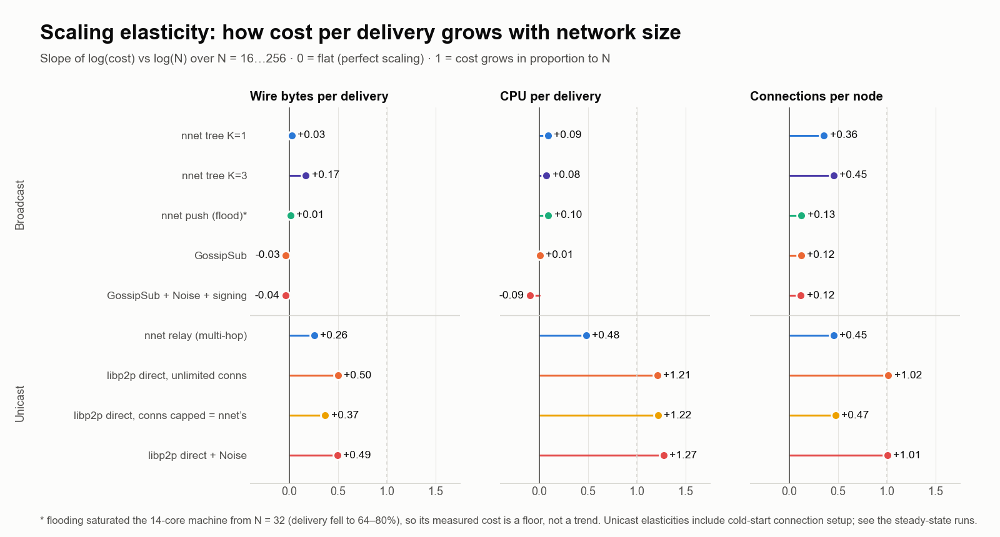
*Figure 19. How each cost grows with N. Broadcast is flat for both stacks; unicast is logarithmic for nnet relay and linear or worse for libp2p direct streams with random destinations.*

**Caveats.** All runs used one 14-core machine and loopback (no WAN latency or bandwidth limits), N ≤ 256, a static network with no churn, and one run per point (expect about ±15% run-to-run variation). Treat the results as relative comparisons and trends, not production capacity. With real WAN round trips, the per-hop latency of nnet's relay and the setup latency of libp2p's dials would both become much larger, in roughly the same proportions as here. The harness, raw results ([results.jsonl](scalability-bench/results.jsonl)) and summary table ([summary.md](scalability-bench/summary.md)) are all in the repository so the experiment can be rerun on real distributed hardware.

---

## 8. Security posture

| Concern | nnet | libp2p |
|---|---|---|
| Peer authentication | None. The ID is self-declared in `ExchangeNode` | Mandatory, PeerID bound to a key during the handshake |
| Transport encryption | None by default (middleware example uses a fixed-key AES-GCM) | Mandatory (Noise / TLS 1.3 / QUIC) |
| Sybil / ID choice | Application must derive IDs from keys (NKN does) | PeerIDs are cheap, so Sybil resistance falls to app/scoring |
| Eclipse resistance | Deterministic neighbors + routing only over self-dialed links | Kademlia bucket diversity, GossipSub scoring, IP colocation penalties |
| DoS | Bounded buffers that drop; no per-peer resource limits | Resource Manager scopes, connection gater, rate limits |
| Private networks | Via middleware | Built-in PSK (`pnet`) |

nnet's defaults assume a **trusted or application-secured environment**. Anyone using it outside NKN should treat "add authentication and encryption middleware" as step one, and should derive per-session keys with an authenticated key exchange instead of the example's fixed key.

---

## 9. Developer experience

**nnet** gets you running quickly:

```go
nn, _ := nnet.NewNNet(nil, nil)
nn.MustApplyMiddleware(node.BytesReceived{Func: func(msg, msgID, srcID []byte, rn *node.RemoteNode) ([]byte, bool) {
    nn.SendBytesRelayReply(msgID, []byte("pong"), srcID)
    return msg, true
}})
nn.Start(false)
nn.Join("tcp://seed.example:30001")
reply, from, _ := nn.SendBytesRelaySync([]byte("ping"), someKey)   // any key, any node, no dial
```

**libp2p** asks for more setup and gives more control in return:

```go
h, _ := libp2p.New()                                  // TCP+QUIC+WebTransport+WebRTC, TLS+Noise, yamux
h.SetStreamHandler("/myapp/ping/1", func(s network.Stream) { /* read/write */ })
kad, _ := dht.New(ctx, h, dht.Mode(dht.ModeAuto))
kad.Bootstrap(ctx)
info, _ := kad.FindPeer(ctx, targetPeerID)            // directory lookup
s, _ := h.NewStream(ctx, info.ID, "/myapp/ping/1")    // direct, encrypted stream
```

nnet's API is **message-oriented and topology-aware**: you think in keys and broadcasts. libp2p's is **stream-oriented and topology-agnostic**: you think in peers and protocols. libp2p's ecosystem is far larger (implementations in a dozen languages, interop testing, browser support, active spec work).

---

## 10. Which one should you use?

**Choose nnet (or its design) when:**

- your application is naturally **key-addressed** (a DHT store, a name-addressed messaging network, sharded consensus) and you want the network to *deliver to a key*, not just look one up;
- nodes are **publicly reachable, long-lived and roughly homogeneous**, such as servers or incentivized operators;
- you need **efficient network-wide broadcast** of high-volume, loss-tolerant data, where the spanning tree's roughly 1× cost is a large win (remember to enable tree dedup);
- you value **deterministic, verifiable topology**, for example to reward or audit relaying;
- you work in Go and want a small codebase you can read in an afternoon and adapt.

**Choose libp2p when:**

- peers are **heterogeneous**: browsers, mobile devices, NATed home machines, multiple languages;
- you need **security by default** (authenticated identity, encryption, DoS limits);
- your traffic is **session-oriented** (file transfer, streaming, RPC to known peers);
- you need **topic-based pubsub** that holds up under adversarial conditions (GossipSub with scoring);
- you want a **long-term-maintained** stack with a spec process and multiple independent implementations.

**Or combine them.** The two are not strictly exclusive. nnet's most interesting ideas, *recursive key-based relay with proximity route selection* and *finger-table spanning-tree broadcast*, could be implemented as a libp2p protocol (`/chord-relay/1.0.0`) running over libp2p streams. That would inherit libp2p's identity, encryption, NAT traversal and resource management. NKN's design is essentially a strong overlay paired with a minimal transport, while libp2p is a strong transport that leaves the overlay to the application.

---

## Appendix A: Reproducing the measurements

Environment: Apple M4 Pro (14 cores), macOS, Go toolchain from Homebrew, nnet at commit `69b4966`, all nodes on localhost over TCP.

```bash
git clone https://github.com/nknorg/nnet && cd nnet && go mod tidy
go build -o eb ./examples/efficient-broadcast
go build -o mb ./examples/message-benchmark
```

```bash
./eb -n 60 -k 3
```

```bash
./mb -n 2
```

```bash
./mb -n 2 -m 1048576
```

```bash
./mb -n 16 -b push
```

```bash
./mb -n 16 -b tree
```

For the "tree dedup on" rows, add `LocalRxMsgCacheRoutingType: []pbmsg.RoutingType{pbmsg.RoutingType_BROADCAST_PUSH, pbmsg.RoutingType_BROADCAST_TREE}` to the `nnet.Config` in `examples/efficient-broadcast/main.go`.

Caveats: these are single-machine runs, so all nodes share one CPU and the loopback interface, and each configuration was run once. Treat them as relative comparisons, not absolute capacity numbers. Broadcast counts vary slightly between runs because node IDs are random.

### Scalability benchmark

The harness in [scalability-bench/](scalability-bench/) reproduces §7.4. Methodology and fairness settings are in its README.

```bash
cd scalability-bench && go build -tags nnet -o bench-nnet . && go build -tags libp2p -o bench-libp2p .
```

```bash
python3 run.py && ./warm.sh && python3 analyze.py
```

The full sweep takes about 90 minutes on a 14-core machine.

### Figures and simulation

All figures in `images/` are generated by [figure-src/figs.py](figure-src/figs.py). The simulator [figure-src/sim.py](figure-src/sim.py) re-implements nnet's finger-table construction, `BROADCAST_TREE` forwarding rule and greedy relay routing on 64-bit rings. Its raw output is in `figure-src/sim.json`.

```bash
cd figure-src && python3 sim.py && python3 figs.py ../images
```

## Appendix B: Sources

**nnet / NKN**
- nnet source and README: <https://github.com/nknorg/nnet>, especially `overlay/chord/{chord,neighborlist,relay,broadcasttree}.go`, `node/remotenode.go`, `config/config.go`
- NKN DDTN technical design doc: <https://github.com/nknorg/nkn/wiki/Tech-Design-Doc%3A-Distributed-Data-Transmission-Network-%28DDTN%29>
- I. Stoica et al., *Chord: A Scalable Peer-to-peer Lookup Service for Internet Applications*, SIGCOMM 2001
- S. El-Ansary, L. O. Alima, P. Brand, S. Haridi, *Efficient Broadcast in Structured P2P Networks*, IPTPS 2003

**libp2p**
- Specifications: <https://github.com/libp2p/specs> (connections, inlined muxer negotiation, kad-dht, pubsub/gossipsub v1.0–v1.3, partial messages, relay/circuit-v2, perf)
- go-libp2p: <https://github.com/libp2p/go-libp2p> (`defaults.go`, `p2p/host/resource-manager`, `p2p/protocol/{autonatv2,circuitv2,holepunch}`)
- go-libp2p-kad-dht: <https://github.com/libp2p/go-libp2p-kad-dht> (`amino/defaults.go`)
- go-libp2p-pubsub: <https://github.com/libp2p/go-libp2p-pubsub> (`gossipsub.go`)
- Performance dashboard: <https://docs.libp2p.io/status>
- D. Trautwein et al., *Challenging Tribal Knowledge: Large Scale Measurement Campaign on Decentralized NAT Traversal*, arXiv:2510.27500 (IMC): <https://arxiv.org/abs/2510.27500>
- ProbeLab, *Can libp2p punch through NATs?*: <https://probelab.io/blog/can-libp2p-punch-through-nats/>
